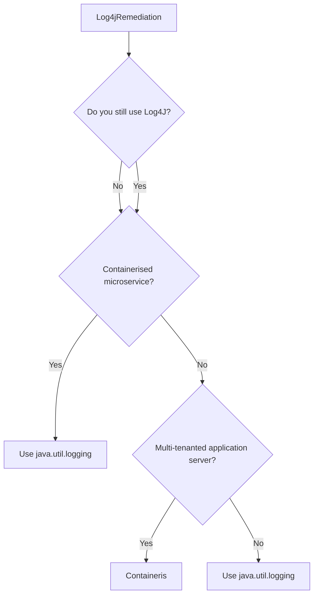

```mermaid
flowchart TD
    A[Log4jRemediation] -->   B{Do you still use Log4J?}
    B --> |No| C(You Win!)
    B --> |Yes| C{Containerised microservice?}
    C --> |Yes| D[Use java.util.logging]
    C --> |No| E{Multi-tenanted application server?} 
    E --> |Yes| F[Containeris]
    E --> |No| G[Use java.util.logging]
```
