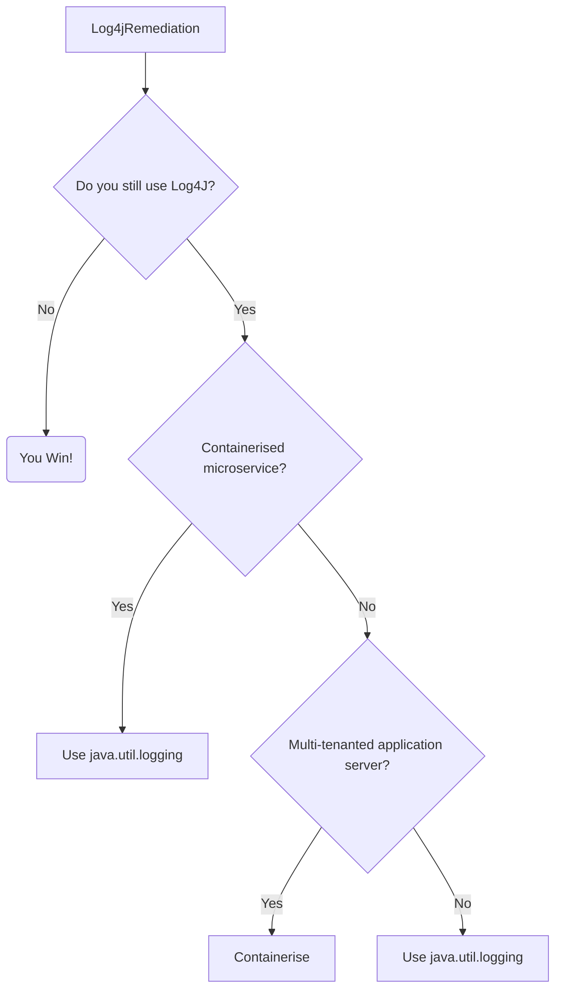

```mermaid
flowchart TD
    A[Log4jRemediation] -->   B{Do you still use Log4J?}
    B --> |No| C(You Win!)
    B --> |Yes| D{Containerised microservice?}
    D --> |Yes| E[Use java.util.logging]
    D --> |No| F{Multi-tenanted application server?} 
    F --> |Yes| G[Containerise]
    F --> |No| H[Use java.util.logging]
```
